# Documentación Completa del Backend - Tiikii Festival

## Tabla de Contenidos

1. [Introducción](#introducción)
2. [Arquitectura del Sistema](#arquitectura-del-sistema)
3. [Patrones de Diseño](#patrones-de-diseño)
4. [Estructura del Proyecto](#estructura-del-proyecto)
5. [Base de Datos](#base-de-datos)
6. [API REST](#api-rest)
7. [Autenticación y Seguridad](#autenticación-y-seguridad)
8. [WebSockets y Tiempo Real](#websockets-y-tiempo-real)
9. [Comunicación Mesh y BitChat](#comunicación-mesh-y-bitchat)
10. [Gestión de Estadías](#gestión-de-estadías)
11. [Sincronización Offline](#sincronización-offline)
12. [Servicios y Lógica de Negocio](#servicios-y-lógica-de-negocio)
13. [Middleware y Manejo de Errores](#middleware-y-manejo-de-errores)
14. [Testing y Calidad](#testing-y-calidad)
15. [Despliegue y Configuración](#despliegue-y-configuración)
16. [Consideraciones de Seguridad](#consideraciones-de-seguridad)
17. [Mantenimiento y Escalabilidad](#mantenimiento-y-escalabilidad)

---

## Introducción

El backend de Tiikii Festival es un sistema de gestión de festivales construido con Node.js, Express y SQLite. Este sistema proporciona capacidades de distribución, compra, validación y gestión de entradas con estándares API y patrones de programación establecidos.

### Características Principales

- **Gestión de Entradas**: Compra, transferencia, cancelación y validación de entradas
- **Procesamiento de Pagos**: Sistema de pagos integrado con seguimiento de transacciones
- **Generación de Códigos QR**: Códigos QR únicos para validación de entradas
- **Gestión de Usuarios**: Autenticación y autorización de usuarios
- **Gestión de Festivales**: Soporte multi-festival con plantillas
- **Actualizaciones en Tiempo Real**: Soporte WebSocket para actualizaciones en vivo
- **Comunicación Mesh**: Red peer-to-peer con BitChat para funcionamiento offline
- **Gestión de Estadías**: Sistema de acceso a habitaciones y espacios del festival
- **Sincronización Offline**: Funcionalidad completa sin conexión a internet
- **Criptografía Avanzada**: Protocolos Noise y Ed25519 para seguridad end-to-end
- **Testing**: Pruebas unitarias, de integración y de rendimiento
- **Seguridad**: Limitación de tasa, validación de entrada y manejo de errores

---

## Arquitectura del Sistema

### Arquitectura General

El sistema implementa una arquitectura de **capas** (Layered Architecture) que separa las responsabilidades del sistema en niveles bien definidos:

```
┌─────────────────────────────────────┐
│           Cliente (Frontend)        │
├─────────────────────────────────────┤
│           API Gateway               │
├─────────────────────────────────────┤
│         Middleware Layer            │
├─────────────────────────────────────┤
│         Routes Layer                │
├─────────────────────────────────────┤
│        Services Layer               │
├─────────────────────────────────────┤
│        Database Layer               │
├─────────────────────────────────────┤
│           SQLite Database           │
└─────────────────────────────────────┘
```

### Componentes de la Arquitectura

#### 1. **Capa de Presentación (Cliente)**
- Aplicaciones móviles React Native
- Interfaz web responsive
- Comunicación vía HTTP REST y WebSockets

#### 2. **Capa de API Gateway**
- Punto de entrada único para todas las solicitudes
- Enrutamiento de solicitudes a los controladores apropiados
- Manejo de CORS y configuración de seguridad básica

#### 3. **Capa de Middleware**
- **Autenticación**: Validación de tokens JWT
- **Seguridad**: Helmet.js, rate limiting, validación de entrada
- **Logging**: Morgan para logging de solicitudes
- **Compresión**: Gzip para optimización de respuestas

#### 4. **Capa de Rutas (Controllers)**
- **Auth Routes**: Registro, login, gestión de perfiles
- **Ticket Routes**: CRUD de entradas, validación QR
- **Festival Routes**: Gestión de festivales y eventos
- **Chat Routes**: Sistema de mensajería en tiempo real
- **User Routes**: Gestión de usuarios y preferencias

#### 5. **Capa de Servicios (Business Logic)**
- **TicketService**: Lógica de compra, validación y transferencia de entradas
- **PaymentService**: Procesamiento de pagos y transacciones
- **UserService**: Gestión de usuarios y autenticación
- **ChatService**: Lógica de chat y notificaciones

#### 6. **Capa de Base de Datos**
- **Database Connection**: Gestión de conexiones SQLite
- **Query Builder**: Abstracción de consultas SQL
- **Transaction Manager**: Manejo de transacciones ACID
- **Migration System**: Control de versiones de esquema

### Flujo de Datos

1. **Cliente** envía solicitud HTTP/WebSocket al servidor
2. **API Gateway** recibe la solicitud y la enruta según el path
3. **Middleware** procesa autenticación, validación y medidas de seguridad
4. **Routes** validan parámetros y delegan a los servicios apropiados
5. **Services** ejecutan la lógica de negocio y validaciones
6. **Database Layer** ejecuta consultas y transacciones
7. **Response** se construye y envía de vuelta al cliente

### Arquitectura de Comunicación

#### HTTP REST API
- **Sincrónico**: Para operaciones CRUD estándar
- **Stateless**: Cada solicitud contiene toda la información necesaria
- **RESTful**: Sigue principios REST para diseño de endpoints

#### WebSocket (Socket.IO)
- **Bidireccional**: Comunicación en tiempo real cliente-servidor
- **Event-driven**: Basado en eventos para chat y notificaciones
- **Persistente**: Conexiones mantenidas durante la sesión del usuario

---

## Patrones de Diseño

### 1. Patrón de Capas (Layered Architecture Pattern)

**Propósito**: Separar el sistema en capas horizontales donde cada capa tiene responsabilidades específicas.

**Implementación**:
- **Separación de Responsabilidades**: Cada capa maneja un aspecto específico del sistema
- **Bajo Acoplamiento**: Las capas se comunican solo con las adyacentes
- **Alta Cohesión**: Funcionalidades relacionadas están agrupadas en la misma capa
- **Inversión de Dependencias**: Las capas superiores dependen de abstracciones de las capas inferiores

**Ventajas**:
- Mantenibilidad del código
- Testabilidad de componentes individuales
- Escalabilidad del sistema
- Reutilización de componentes

### 2. Patrón de Servicios (Service Layer Pattern)

**Propósito**: Encapsular la lógica de negocio en servicios reutilizables y testables.

**Implementación**:
```javascript
// Ejemplo del TicketService
class TicketService {
    async purchaseTicket(userId, festivalId, templateId, holderName, options = {}) {
        return await database.transaction(async (db) => {
            // Lógica de negocio encapsulada
            // Validaciones
            // Creación de entradas
            // Actualización de inventario
        });
    }
}
```

**Características**:
- **Single Responsibility**: Cada servicio maneja una entidad de negocio específica
- **Dependency Injection**: Los servicios reciben sus dependencias como parámetros
- **Transaction Management**: Manejo de transacciones de base de datos
- **Business Logic Encapsulation**: Toda la lógica de negocio está centralizada

### 3. Patrón de Repositorio (Repository Pattern)

**Propósito**: Abstraer la lógica de acceso a datos y proporcionar una interfaz uniforme.

**Implementación**:
```javascript
// Abstracción de la base de datos
const database = {
    get: async (query, params) => { /* ... */ },
    run: async (query, params) => { /* ... */ },
    transaction: async (callback) => { /* ... */ }
};
```

**Beneficios**:
- **Data Access Abstraction**: Ocultar detalles de implementación de la base de datos
- **Testability**: Fácil mockeo para testing
- **Database Agnostic**: Cambio de base de datos sin afectar la lógica de negocio
- **Query Centralization**: Centralización de consultas SQL

### 4. Patrón de Middleware (Middleware Pattern)

**Propósito**: Procesar solicitudes HTTP a través de una cadena de funciones antes de llegar al controlador.

**Implementación**:
```javascript
// Cadena de middleware para procesamiento de solicitudes
app.use(helmet());           // Seguridad
app.use(cors());            // CORS
app.use(rateLimit());       // Limitación de tasa
app.use(authenticateToken); // Autenticación
```

**Características**:
- **Chain of Responsibility**: Cada middleware puede procesar o pasar la solicitud
- **Cross-cutting Concerns**: Manejo de aspectos transversales como logging y seguridad
- **Modularity**: Middleware independiente y reutilizable
- **Order Dependency**: El orden de los middleware es importante

### 5. Patrón de Manejo de Errores (Error Handling Pattern)

**Propósito**: Centralizar el manejo de errores y proporcionar respuestas consistentes.

**Implementación**:
```javascript
// Middleware centralizado de manejo de errores
app.use(errorHandler);

// Clases de error personalizadas
class ValidationError extends Error { /* ... */ }
class NotFoundError extends Error { /* ... */ }
class BusinessLogicError extends Error { /* ... */ }
```

**Aspectos**:
- **Error Classification**: Categorización de errores por tipo
- **Consistent Response Format**: Formato uniforme de respuesta de error
- **Error Logging**: Registro centralizado de errores
- **Graceful Degradation**: Manejo elegante de fallos

### 6. Patrón de Factory (Factory Pattern)

**Propósito**: Crear objetos sin especificar su clase exacta.

**Implementación**:
```javascript
// Factory para crear diferentes tipos de entradas
class TicketFactory {
    static createTicket(type, data) {
        switch(type) {
            case 'vip': return new VIPTicket(data);
            case 'general': return new GeneralTicket(data);
            case 'student': return new StudentTicket(data);
            default: throw new Error('Tipo de entrada no válido');
        }
    }
}
```

### 7. Patrón de Observer (Observer Pattern)

**Propósito**: Implementar comunicación entre componentes cuando cambia el estado de un objeto.

**Implementación**:
```javascript
// Sistema de notificaciones
class NotificationService {
    constructor() {
        this.observers = [];
    }
    
    subscribe(observer) {
        this.observers.push(observer);
    }
    
    notify(data) {
        this.observers.forEach(observer => observer.update(data));
    }
}
```

---

## Estructura del Proyecto

```
src/
├── database/                    # Capa de base de datos
│   ├── database.js             # Conexión y operaciones de BD
│   ├── schema.sql              # Esquema de la base de datos
│   ├── mesh_schema_simple.sql  # Esquema de red mesh y estadías
│   ├── migrate.js              # Migraciones de BD
│   ├── migrate_mesh.js         # Migración de tablas mesh
│   └── seed.js                 # Datos de prueba
├── middleware/                  # Capa de middleware
│   ├── auth.js                 # Middleware de autenticación
│   ├── errorHandler.js         # Manejo de errores
│   └── security.js             # Configuraciones de seguridad
├── routes/                      # Capa de rutas
│   ├── auth.js                 # Rutas de autenticación
│   ├── tickets.js              # Gestión de entradas
│   ├── festivals.js            # Gestión de festivales
│   ├── chat.js                 # Sistema de chat
│   ├── mesh.js                 # API de red mesh y estadías
│   ├── users.js                # Gestión de usuarios
│   ├── vendors.js              # Gestión de vendedores
│   ├── pois.js                 # Puntos de interés
│   ├── schedule.js             # Programación de eventos
│   ├── artists.js              # Gestión de artistas
│   └── widgets.js              # Widgets del sistema
├── services/                    # Capa de servicios
│   ├── TicketService.js        # Lógica de negocio de entradas
│   ├── PaymentService.js       # Procesamiento de pagos
│   ├── MeshNetworkService.js   # Gestión de red mesh y peers
│   ├── EstadiasService.js      # Gestión de estadías y accesos
│   └── OfflineSyncService.js   # Sincronización offline
├── utils/                       # Utilidades
│   ├── errors.js               # Clases de error personalizadas
│   └── cryptoUtils.js          # Utilidades criptográficas
├── socket/                      # Capa de WebSockets
│   └── handlers.js             # Manejadores de eventos WebSocket
└── index.js                     # Punto de entrada principal
```

---

## Base de Datos

### Esquema de Base de Datos

El sistema utiliza **SQLite** como base de datos principal, con un esquema relacional bien diseñado:

#### Tablas Principales

**Tablas del Sistema Principal:**
1. **users** - Gestión de usuarios del sistema
2. **festivals** - Información de festivales
3. **tickets** - Entradas de usuarios
4. **ticket_templates** - Plantillas de entradas
5. **payments** - Transacciones de pago
6. **chat_rooms** - Salas de chat
7. **chat_messages** - Mensajes de chat
8. **artists** - Información de artistas
9. **schedule** - Programación de eventos
10. **vendors** - Vendedores y servicios
11. **points_of_interest** - Puntos de interés en el festival

**Tablas de Red Mesh y Estadías:**
12. **mesh_peers** - Dispositivos conectados a la red mesh
13. **mesh_messages** - Mensajes de la red mesh
14. **estadias** - Reservas de habitaciones y espacios
15. **room_access_logs** - Registro de accesos a habitaciones
16. **offline_queue** - Cola de sincronización offline

#### Relaciones Clave

```sql
-- Relación Festival -> Entradas
festivals (1) ←→ (N) tickets

-- Relación Usuario -> Entradas
users (1) ←→ (N) tickets

-- Relación Festival -> Plantillas de Entradas
festivals (1) ←→ (N) ticket_templates

-- Relación Usuario -> Pagos
users (1) ←→ (N) payments
```

### Índices de Rendimiento

```sql
-- Índices para optimizar consultas frecuentes
CREATE INDEX idx_tickets_user_id ON tickets(user_id);
CREATE INDEX idx_tickets_festival_id ON tickets(festival_id);
CREATE INDEX idx_payments_user_id ON payments(user_id);
CREATE INDEX idx_chat_messages_room_id ON chat_messages(room_id);
CREATE INDEX idx_schedule_festival_id ON schedule(festival_id);
```

### Transacciones

El sistema utiliza transacciones de base de datos para garantizar la consistencia de datos:

```javascript
// Ejemplo de transacción en la compra de entradas
return await database.transaction(async (db) => {
    // 1. Validar disponibilidad
    // 2. Crear entrada
    // 3. Actualizar inventario
    // 4. Procesar pago
    // Si algo falla, se revierte todo
});
```

---

## API REST

### Estructura de Endpoints

#### Autenticación
```
POST   /api/auth/register     # Registro de usuario
POST   /api/auth/login        # Inicio de sesión
POST   /api/auth/logout       # Cierre de sesión
GET    /api/auth/profile      # Perfil de usuario
```

#### Gestión de Entradas
```
GET    /api/tickets                    # Lista de entradas del usuario
GET    /api/tickets/:id                # Entrada específica
POST   /api/tickets/purchase           # Compra de entrada
POST   /api/tickets/validate/:qrCode  # Validación de entrada
POST   /api/tickets/:id/transfer      # Transferencia de entrada
POST   /api/tickets/:id/cancel        # Cancelación de entrada
```

#### Gestión de Festivales
```
GET    /api/festivals                  # Lista de festivales
GET    /api/festivals/:id              # Festival específico
POST   /api/festivals                  # Crear festival (admin)
PUT    /api/festivals/:id              # Actualizar festival (admin)
DELETE /api/festivals/:id              # Eliminar festival (admin)
```

#### Sistema de Chat
```
GET    /api/chat/rooms                 # Salas de chat disponibles
GET    /api/chat/rooms/:id/messages    # Mensajes de una sala
POST   /api/chat/rooms/:id/messages    # Enviar mensaje
POST   /api/chat/rooms                 # Crear sala de chat
```

### Estructura de Respuestas

#### Respuesta Exitosa
```json
{
    "success": true,
    "data": {
        "id": "uuid",
        "name": "Festival Name",
        "description": "Description"
    },
    "message": "Operation completed successfully"
}
```

#### Respuesta de Error
```json
{
    "success": false,
    "error": {
        "type": "ValidationError",
        "message": "Invalid input data",
        "details": ["Field 'email' is required"]
    },
    "timestamp": "2024-01-01T00:00:00.000Z"
}
```

---

## Autenticación y Seguridad

### Sistema de Autenticación JWT

#### Generación de Tokens
```javascript
const generateToken = (userId) => {
    return jwt.sign(
        { userId },
        JWT_SECRET,
        { expiresIn: '7d' } // Token expira en 7 días
    );
};
```

#### Middleware de Autenticación
```javascript
const authenticateToken = async (req, res, next) => {
    const token = req.headers['authorization']?.split(' ')[1];
    
    if (!token) {
        return res.status(401).json({ error: 'Access token required' });
    }
    
    try {
        const decoded = jwt.verify(token, JWT_SECRET);
        const user = await database.get('SELECT * FROM users WHERE id = ?', [decoded.userId]);
        req.user = user;
        next();
    } catch (error) {
        return res.status(401).json({ error: 'Invalid token' });
    }
};
```

### Medidas de Seguridad

#### 1. Helmet.js
```javascript
app.use(helmet({
    contentSecurityPolicy: {
        directives: {
            defaultSrc: ["'self'"],
            styleSrc: ["'self'", "'unsafe-inline'"],
            scriptSrc: ["'self'"],
            imgSrc: ["'self'", "data:", "https:"],
        },
    },
}));
```

#### 2. Limitación de Tasa (Rate Limiting)
```javascript
const limiter = rateLimit({
    windowMs: 15 * 60 * 1000, // 15 minutos
    max: 100, // máximo 100 solicitudes por ventana
    message: 'Too many requests from this IP'
});
app.use('/api/', limiter);
```

#### 3. Validación de Entrada
```javascript
const registerValidation = [
    body('username')
        .isLength({ min: 3, max: 30 })
        .matches(/^[a-zA-Z0-9_]+$/),
    body('email')
        .isEmail()
        .normalizeEmail(),
    body('password')
        .isLength({ min: 6 })
];
```

#### 4. Hash de Contraseñas
```javascript
const saltRounds = 12;
const passwordHash = await bcrypt.hash(password, saltRounds);
```

---

## WebSockets y Tiempo Real

### Implementación de Socket.IO

#### Configuración del Servidor
```javascript
const io = new Server(server, {
    cors: {
        origin: [
            process.env.CLIENT_URL || "http://localhost:3000",
            "http://localhost:8081"
        ],
        methods: ["GET", "POST"]
    }
});
```

#### Autenticación de Sockets
```javascript
const authenticateSocket = async (socket, next) => {
    try {
        const token = socket.handshake.auth.token;
        const decoded = jwt.verify(token, JWT_SECRET);
        const user = await database.get('SELECT * FROM users WHERE id = ?', [decoded.userId]);
        
        socket.userId = user.id;
        socket.user = user;
        next();
    } catch (error) {
        next(new Error('Authentication error'));
    }
};
```

#### Eventos Principales

1. **Conexión/Desconexión**
   - `connection` - Usuario se conecta
   - `disconnect` - Usuario se desconecta

2. **Gestión de Festivales**
   - `join-festival` - Unirse a un festival
   - `leave-festival` - Salir de un festival

3. **Chat en Tiempo Real**
   - `send-message` - Enviar mensaje
   - `typing` - Indicador de escritura
   - `read-messages` - Marcar mensajes como leídos

4. **Presencia de Usuarios**
   - `update-location` - Actualizar ubicación
   - `user-joined` - Usuario se unió
   - `user-left` - Usuario salió

#### Gestión de Salas
```javascript
// Unirse a sala de festival
socket.on('join-festival', async (data) => {
    const { festivalId } = data;
    socket.join(`festival:${festivalId}`);
    
    // Actualizar presencia del usuario
    await updateUserPresence(socket.userId, festivalId, 'online');
    
    // Notificar a otros usuarios
    socket.to(`festival:${festivalId}`).emit('user-joined', {
        userId: socket.userId,
        username: socket.user.username
    });
});
```

---

## Comunicación Mesh y BitChat

### Integración BitChat

El sistema integra la tecnología BitChat para proporcionar comunicación peer-to-peer descentralizada, especialmente útil en festivales donde la conectividad tradicional puede ser limitada.

#### Arquitectura de la Red Mesh

La implementación utiliza múltiples protocolos de comunicación:

1. **Bluetooth Low Energy (BLE)**: Para comunicación local entre dispositivos
2. **Protocolo Nostr**: Para comunicación a través de internet cuando esté disponible
3. **WiFi Direct**: Para conexiones directas entre dispositivos móviles

#### Características de BitChat

```javascript
// Configuración de BitChat
const bitchatConfig = {
    protocols: {
        bluetooth: {
            enabled: true,
            scanInterval: 30000, // 30 segundos
            advertiseInterval: 15000 // 15 segundos
        },
        nostr: {
            enabled: true,
            relays: ['wss://relay.example.com', 'wss://backup.relay.com'],
            reconnectInterval: 5000
        },
        wifi: {
            enabled: true,
            discoveryTimeout: 10000
        }
    },
    encryption: {
        protocol: 'noise_xx', // Noise Protocol Framework
        keyDerivation: 'curve25519',
        signing: 'ed25519'
    }
};
```

#### Gestión de Peers

```javascript
// Ejemplo de gestión de peers en la red mesh
class MeshPeerManager {
    async registerPeer(peerData) {
        const { noisePublicKey, signingPublicKey, nickname } = peerData;
        
        // Validar claves criptográficas
        if (!this.validateKeys(noisePublicKey, signingPublicKey)) {
            throw new ValidationError('Invalid cryptographic keys');
        }
        
        // Almacenar en base de datos
        const peer = await database.run(`
            INSERT INTO mesh_peers (id, noise_public_key, signing_public_key, nickname, last_seen)
            VALUES (?, ?, ?, ?, ?)
        `, [uuidv4(), noisePublicKey, signingPublicKey, nickname, new Date()]);
        
        return peer;
    }
    
    async updatePeerStatus(peerId, status) {
        await database.run(`
            UPDATE mesh_peers 
            SET is_connected = ?, last_seen = ?
            WHERE id = ?
        `, [status.connected, new Date(), peerId]);
    }
}
```

#### Cifrado End-to-End

El sistema utiliza el Noise Protocol Framework para seguridad:

```javascript
// Implementación de cifrado con Noise Protocol
class NoiseEncryption {
    constructor() {
        this.keyPair = this.generateKeyPair();
    }
    
    generateKeyPair() {
        // Generar par de claves Curve25519
        return crypto.generateKeyPairSync('x25519');
    }
    
    async encryptMessage(message, recipientPublicKey) {
        // Implementar Noise XX pattern
        const handshake = new NoiseHandshake('XX', true);
        handshake.initialize(Buffer.alloc(0));
        
        // Proceso de handshake y cifrado
        const encrypted = handshake.encrypt(Buffer.from(message));
        return encrypted.toString('base64');
    }
    
    async decryptMessage(encryptedMessage, senderPublicKey) {
        const handshake = new NoiseHandshake('XX', false);
        const decrypted = handshake.decrypt(Buffer.from(encryptedMessage, 'base64'));
        return decrypted.toString('utf8');
    }
}
```

#### API de Red Mesh

```javascript
// Endpoints de la API mesh
app.post('/api/mesh/peers', async (req, res) => {
    const peerData = req.body;
    const peer = await meshNetworkService.upsertPeer(peerData);
    res.json({ success: true, data: peer });
});

app.post('/api/mesh/messages', async (req, res) => {
    const messageData = req.body;
    const message = await meshNetworkService.storeMeshMessage(messageData);
    res.json({ success: true, data: message });
});

app.get('/api/mesh/peers/:id/messages', async (req, res) => {
    const { id } = req.params;
    const messages = await meshNetworkService.getMessagesForPeer(id);
    res.json({ success: true, data: messages });
});
```

---

## Gestión de Estadías

### Sistema de Estadías

El sistema de estadías permite gestionar el acceso a habitaciones, áreas VIP y espacios especiales dentro del festival.

#### Características Principales

1. **Reserva de Espacios**: Gestión de habitaciones y áreas especiales
2. **Códigos de Acceso**: Generación de códigos únicos para cada estadia
3. **Control de Acceso**: Validación de permisos en tiempo real
4. **Registro de Actividad**: Log completo de accesos y salidas

#### Modelo de Datos

```javascript
// Estructura de una estadia
const estadiaSchema = {
    id: 'uuid',
    userId: 'string',
    festivalId: 'string',
    roomId: 'string',
    accessCode: 'string (unique)',
    startTime: 'datetime',
    endTime: 'datetime',
    status: 'enum: active|checked_in|checked_out|cancelled|expired',
    checkInTime: 'datetime (nullable)',
    checkOutTime: 'datetime (nullable)',
    metadata: 'json'
};
```

#### Implementación del Servicio

```javascript
class EstadiasService {
    async createEstadia(estadiaData) {
        const { userId, festivalId, roomId, startTime, endTime } = estadiaData;
        
        // Validar disponibilidad del espacio
        const conflicts = await this.checkRoomAvailability(roomId, startTime, endTime);
        if (conflicts.length > 0) {
            throw new BusinessLogicError('Room not available for selected time period');
        }
        
        // Generar código de acceso único
        const accessCode = this.generateAccessCode();
        
        // Crear estadia
        const estadiaId = uuidv4();
        await database.run(`
            INSERT INTO estadias (id, user_id, festival_id, room_id, access_code, 
                                start_time, end_time, status, created_at)
            VALUES (?, ?, ?, ?, ?, ?, ?, 'active', ?)
        `, [estadiaId, userId, festivalId, roomId, accessCode, 
             startTime, endTime, new Date()]);
        
        return await this.getEstadiaById(estadiaId);
    }
    
    async validateRoomAccess(accessCode, roomId) {
        const estadia = await database.get(`
            SELECT * FROM estadias 
            WHERE access_code = ? AND room_id = ? AND status = 'active'
        `, [accessCode, roomId]);
        
        if (!estadia) {
            return { valid: false, reason: 'Invalid access code' };
        }
        
        const now = new Date();
        if (now < new Date(estadia.start_time)) {
            return { valid: false, reason: 'Access not yet valid' };
        }
        
        if (now > new Date(estadia.end_time)) {
            return { valid: false, reason: 'Access expired' };
        }
        
        // Registrar acceso
        await this.logRoomAccess(estadia.id, estadia.user_id, roomId, true);
        
        return { valid: true, estadia };
    }
    
    generateAccessCode() {
        // Generar código alfanumérico de 8 caracteres
        return crypto.randomBytes(4).toString('hex').toUpperCase();
    }
}
```

#### API de Estadías

```javascript
// Crear nueva estadia
app.post('/api/mesh/estadias', [
    body('userId').notEmpty(),
    body('festivalId').notEmpty(),
    body('roomId').notEmpty(),
    body('startTime').isISO8601(),
    body('endTime').isISO8601()
], async (req, res) => {
    const estadia = await estadiasService.createEstadia(req.body);
    res.status(201).json({ success: true, data: estadia });
});

// Validar acceso a habitación
app.post('/api/mesh/estadias/validate', [
    body('accessCode').notEmpty(),
    body('roomId').notEmpty()
], async (req, res) => {
    const { accessCode, roomId } = req.body;
    const validation = await estadiasService.validateRoomAccess(accessCode, roomId);
    
    if (validation.valid) {
        res.json({ success: true, data: validation.estadia });
    } else {
        res.status(403).json({ 
            success: false, 
            error: validation.reason 
        });
    }
});
```

---

## Sincronización Offline

### Sistema de Sincronización Offline

El sistema permite que la aplicación funcione completamente offline, almacenando acciones en una cola local y sincronizándolas cuando la conectividad se restaure.

#### Arquitectura de Sincronización

```javascript
// Cola de sincronización offline
const offlineQueueSchema = {
    id: 'uuid',
    userId: 'string',
    type: 'enum: message|favorite|location|notification',
    data: 'json',
    timestamp: 'datetime',
    isProcessed: 'boolean',
    processedAt: 'datetime (nullable)'
};
```

#### Implementación del Servicio

```javascript
class OfflineSyncService {
    async enqueueOfflineItem(userId, type, data) {
        const itemId = uuidv4();
        
        await database.run(`
            INSERT INTO offline_queue (id, user_id, type, data, timestamp, is_processed)
            VALUES (?, ?, ?, ?, ?, 0)
        `, [itemId, userId, type, JSON.stringify(data), new Date()]);
        
        return await this.getOfflineItemById(itemId);
    }
    
    async processOfflineQueue(userId) {
        const pendingItems = await this.getPendingOfflineItems(userId);
        const results = [];
        
        for (const item of pendingItems) {
            try {
                const result = await this.processOfflineItem(item);
                await this.markItemAsProcessed(item.id);
                results.push({ itemId: item.id, success: true, result });
            } catch (error) {
                results.push({ itemId: item.id, success: false, error: error.message });
            }
        }
        
        return results;
    }
    
    async processOfflineItem(item) {
        switch (item.type) {
            case 'message':
                return await this.processMeshMessage(item.data);
            case 'favorite':
                return await this.processFavoriteAction(item.data);
            case 'location':
                return await this.processLocationUpdate(item.data);
            case 'notification':
                return await this.processNotification(item.data);
            default:
                throw new Error(`Unknown offline item type: ${item.type}`);
        }
    }
    
    async processMeshMessage(messageData) {
        // Enviar mensaje a través de la red mesh
        return await meshNetworkService.storeMeshMessage(messageData);
    }
}
```

#### Estrategias de Conflicto

```javascript
// Resolución de conflictos en sincronización
class ConflictResolver {
    async resolveConflicts(localItem, serverItem) {
        // Estrategia: Last-Write-Wins con timestamp
        if (new Date(localItem.timestamp) > new Date(serverItem.timestamp)) {
            return localItem; // Mantener versión local
        } else {
            return serverItem; // Usar versión del servidor
        }
    }
    
    async mergeData(localData, serverData) {
        // Implementar lógica de merge específica por tipo de dato
        return {
            ...serverData,
            ...localData,
            mergedAt: new Date()
        };
    }
}
```

#### Detección de Conectividad

```javascript
// Monitor de conectividad
class ConnectivityMonitor {
    constructor() {
        this.isOnline = navigator.onLine;
        this.listeners = [];
        
        window.addEventListener('online', () => {
            this.isOnline = true;
            this.notifyListeners('online');
        });
        
        window.addEventListener('offline', () => {
            this.isOnline = false;
            this.notifyListeners('offline');
        });
    }
    
    onStatusChange(callback) {
        this.listeners.push(callback);
    }
    
    notifyListeners(status) {
        this.listeners.forEach(callback => callback(status));
    }
    
    async testConnectivity() {
        try {
            const response = await fetch('/api/health', { 
                method: 'HEAD',
                timeout: 5000 
            });
            return response.ok;
        } catch (error) {
            return false;
        }
    }
}
```

---

## Servicios y Lógica de Negocio

### TicketService

#### Compra de Entradas
```javascript
async purchaseTicket(userId, festivalId, templateId, holderName, options = {}) {
    return await database.transaction(async (db) => {
        // 1. Validar festival activo
        const festival = await db.get(
            'SELECT * FROM festivals WHERE id = ? AND is_active = 1',
            [festivalId]
        );
        
        // 2. Validar plantilla disponible
        const template = await db.get(
            'SELECT * FROM ticket_templates WHERE id = ? AND is_available = 1',
            [templateId, festivalId]
        );
        
        // 3. Verificar disponibilidad
        if (template.max_quantity && template.current_quantity >= template.max_quantity) {
            throw new BusinessLogicError('This ticket type is sold out');
        }
        
        // 4. Generar entrada única
        const ticketId = uuidv4();
        const qrPayload = this.generateQRPayload(festivalId, template.name, ticketId);
        
        // 5. Crear entrada
        await db.run(`
            INSERT INTO tickets (id, user_id, festival_id, template_id, qr_payload, 
                               holder_name, tier, valid_from, valid_to, price)
            VALUES (?, ?, ?, ?, ?, ?, ?, ?, ?, ?)
        `, [ticketId, userId, festivalId, templateId, qrPayload,
             holderName, template.name, festival.start_date, festival.end_date, template.price]);
        
        // 6. Actualizar inventario
        await db.run(
            'UPDATE ticket_templates SET current_quantity = current_quantity + 1 WHERE id = ?',
            [templateId]
        );
        
        return await this.getTicketById(ticketId, userId);
    });
}
```

#### Validación de Entradas
```javascript
async validateTicket(qrPayload, festivalId) {
    const ticket = await database.get(`
        SELECT t.*, f.name as festival_name, f.start_date, f.end_date
        FROM tickets t
        JOIN festivals f ON t.festival_id = f.id
        WHERE t.qr_payload = ? AND t.festival_id = ?
    `, [qrPayload, festivalId]);
    
    if (!ticket) {
        throw new NotFoundError('Ticket not found');
    }
    
    if (ticket.status !== 'active') {
        throw new BusinessLogicError(`Ticket is ${ticket.status}`);
    }
    
    const now = new Date();
    if (now < ticket.valid_from || now > ticket.valid_to) {
        throw new BusinessLogicError('Ticket is not valid at this time');
    }
    
    return ticket;
}
```

### PaymentService

#### Procesamiento de Pagos
```javascript
async processPayment(userId, festivalId, templateId, paymentMethod, amount) {
    return await database.transaction(async (db) => {
        // 1. Crear registro de pago
        const paymentId = uuidv4();
        await db.run(`
            INSERT INTO payments (id, user_id, festival_id, template_id, 
                                amount, payment_method_type, payment_method_token, status)
            VALUES (?, ?, ?, ?, ?, ?, ?, ?)
        `, [paymentId, userId, festivalId, templateId, amount, 
             paymentMethod.type, paymentMethod.token, 'pending']);
        
        // 2. Simular procesamiento de pago (en producción, integrar con gateway real)
        const paymentResult = await this.simulatePaymentGateway(paymentMethod, amount);
        
        // 3. Actualizar estado del pago
        await db.run(`
            UPDATE payments 
            SET status = ?, gateway_transaction_id = ?, processed_at = ?
            WHERE id = ?
        `, [paymentResult.status, paymentResult.transactionId, new Date(), paymentId]);
        
        return { paymentId, status: paymentResult.status, transactionId: paymentResult.transactionId };
    });
}
```

### MeshNetworkService

El `MeshNetworkService` gestiona la comunicación peer-to-peer y el almacenamiento de mensajes en la red mesh.

#### Gestión de Peers

```javascript
async upsertPeer(peerData) {
    const { id, noise_public_key, signing_public_key, nickname } = peerData;
    
    // Validar datos del peer
    if (!noise_public_key || !signing_public_key || !nickname) {
        throw new ValidationError('Missing required peer data');
    }
    
    // Verificar si el peer existe
    const existingPeer = await database.get(
        'SELECT * FROM mesh_peers WHERE id = ?',
        [id]
    );
    
    if (existingPeer) {
        // Actualizar peer existente
        await database.run(`
            UPDATE mesh_peers 
            SET noise_public_key = ?, signing_public_key = ?, nickname = ?, 
                last_seen = CURRENT_TIMESTAMP, is_connected = 1
            WHERE id = ?
        `, [noise_public_key, signing_public_key, nickname, id]);
    } else {
        // Crear nuevo peer
        await database.run(`
            INSERT INTO mesh_peers (id, noise_public_key, signing_public_key, nickname, 
                                  last_seen, is_connected, is_reachable)
            VALUES (?, ?, ?, ?, CURRENT_TIMESTAMP, 1, 1)
        `, [id, noise_public_key, signing_public_key, nickname]);
    }
    
    return await this.getPeerById(id);
}
```

#### Gestión de Mensajes

```javascript
async storeMeshMessage(messageData) {
    const { id, sender_id, recipient_id, content, is_private = false, is_encrypted = false } = messageData;
    
    // Validar datos del mensaje
    if (!sender_id || !content) {
        throw new ValidationError('Missing required message data');
    }
    
    const messageId = id || uuidv4();
    
    await database.run(`
        INSERT INTO mesh_messages (id, sender_id, recipient_id, content, 
                                 is_private, is_encrypted, delivery_status)
        VALUES (?, ?, ?, ?, ?, ?, 'pending')
    `, [messageId, sender_id, recipient_id, content, is_private, is_encrypted]);
    
    return await this.getMeshMessageById(messageId);
}
```

### EstadiasService

El `EstadiasService` maneja la lógica de negocio para la gestión de estadías y accesos a espacios.

#### Creación de Estadías

```javascript
async createEstadia(estadiaData) {
    const { user_id, festival_id, room_id, start_time, end_time } = estadiaData;
    
    // Validar fechas
    const startDate = new Date(start_time);
    const endDate = new Date(end_time);
    
    if (startDate >= endDate) {
        throw new ValidationError('End time must be after start time');
    }
    
    if (startDate < new Date()) {
        throw new ValidationError('Start time cannot be in the past');
    }
    
    // Generar código de acceso único
    const access_code = this.generateAccessCode();
    const estadiaId = uuidv4();
    
    await database.run(`
        INSERT INTO estadias (id, user_id, festival_id, room_id, access_code, 
                            start_time, end_time, status, created_at, updated_at)
        VALUES (?, ?, ?, ?, ?, ?, ?, 'active', CURRENT_TIMESTAMP, CURRENT_TIMESTAMP)
    `, [estadiaId, user_id, festival_id, room_id, access_code, start_time, end_time]);
    
    return await this.getEstadiaById(estadiaId);
}
```

#### Validación de Acceso

```javascript
async validateRoomAccess(access_code, room_id) {
    const estadia = await database.get(`
        SELECT * FROM estadias 
        WHERE access_code = ? AND room_id = ? AND status IN ('active', 'checked_in')
    `, [access_code, room_id]);
    
    if (!estadia) {
        return { valid: false, reason: 'Invalid access code or room' };
    }
    
    const now = new Date();
    const startTime = new Date(estadia.start_time);
    const endTime = new Date(estadia.end_time);
    
    if (now < startTime) {
        return { valid: false, reason: 'Access period has not started yet' };
    }
    
    if (now > endTime) {
        return { valid: false, reason: 'Access period has expired' };
    }
    
    // Registrar el acceso
    await database.run(`
        INSERT INTO room_access_logs (id, estadia_id, user_id, room_id, access_granted, reason)
        VALUES (?, ?, ?, ?, 1, 'Valid access code')
    `, [uuidv4(), estadia.id, estadia.user_id, room_id]);
    
    return { valid: true, estadia };
}
```

### OfflineSyncService

El `OfflineSyncService` gestiona la sincronización de datos cuando la conectividad se restaura.

#### Cola de Sincronización

```javascript
async enqueueOfflineItem(userId, type, data) {
    const itemId = uuidv4();
    
    // Validar tipo de elemento
    const validTypes = ['message', 'favorite', 'location', 'notification'];
    if (!validTypes.includes(type)) {
        throw new ValidationError(`Invalid offline item type: ${type}`);
    }
    
    await database.run(`
        INSERT INTO offline_queue (id, user_id, type, data, timestamp, is_processed)
        VALUES (?, ?, ?, ?, CURRENT_TIMESTAMP, 0)
    `, [itemId, userId, type, JSON.stringify(data)]);
    
    return await this.getOfflineItemById(itemId);
}
```

#### Procesamiento de Cola

```javascript
async processOfflineQueue(userId) {
    const pendingItems = await this.getPendingOfflineItems(userId);
    const results = [];
    
    for (const item of pendingItems) {
        try {
            let result;
            
            switch (item.type) {
                case 'message':
                    result = await this.processMeshMessage(item.data);
                    break;
                case 'favorite':
                    result = await this.processFavoriteAction(item.data);
                    break;
                case 'location':
                    result = await this.processLocationUpdate(item.data);
                    break;
                case 'notification':
                    result = await this.processNotification(item.data);
                    break;
                default:
                    throw new Error(`Unknown item type: ${item.type}`);
            }
            
            // Marcar como procesado
            await this.markItemAsProcessed(item.id);
            results.push({ itemId: item.id, success: true, result });
            
        } catch (error) {
            results.push({ 
                itemId: item.id, 
                success: false, 
                error: error.message 
            });
        }
    }
    
    return results;
}
```

---

## Middleware y Manejo de Errores

### Middleware de Autenticación

```javascript
// Verificar si el usuario está verificado
const requireVerified = (req, res, next) => {
    if (!req.user.is_verified) {
        return res.status(403).json({ 
            error: 'Email not verified',
            message: 'Please verify your email address before accessing this resource'
        });
    }
    next();
};

// Verificar si el usuario es administrador
const requireAdmin = (req, res, next) => {
    if (!req.user.is_admin) {
        return res.status(403).json({ 
            error: 'Admin access required',
            message: 'You do not have permission to access this resource'
        });
    }
    next();
};
```

### Middleware de Manejo de Errores

```javascript
const errorHandler = (err, req, res, next) => {
    console.error('Error:', err);
    
    // Errores de validación
    if (err.name === 'ValidationError') {
        return res.status(400).json({
            success: false,
            error: {
                type: 'ValidationError',
                message: err.message,
                details: err.details || []
            }
        });
    }
    
    // Errores de autenticación
    if (err.name === 'UnauthorizedError') {
        return res.status(401).json({
            success: false,
            error: {
                type: 'UnauthorizedError',
                message: 'Authentication required'
            }
        });
    }
    
    // Errores de negocio
    if (err.name === 'BusinessLogicError') {
        return res.status(422).json({
            success: false,
            error: {
                type: 'BusinessLogicError',
                message: err.message
            }
        });
    }
    
    // Error interno del servidor
    return res.status(500).json({
        success: false,
        error: {
            type: 'InternalServerError',
            message: 'An unexpected error occurred'
        }
    });
};
```

### Middleware de Seguridad

```javascript
// Configuración de CORS
app.use(cors({
    origin: [
        process.env.CLIENT_URL || "http://localhost:3000",
        "http://localhost:8081"
    ],
    credentials: true,
    methods: ['GET', 'POST', 'PUT', 'DELETE', 'OPTIONS'],
    allowedHeaders: ['Content-Type', 'Authorization']
}));

// Compresión de respuestas
app.use(compression());

// Logging
if (process.env.NODE_ENV === 'development') {
    app.use(morgan('dev'));
} else {
    app.use(morgan('combined'));
}
```

---

## Testing y Calidad

### Estrategia de Testing

#### 1. Testing Unitario
```javascript
// Ejemplo de test unitario para TicketService
describe('TicketService', () => {
    describe('purchaseTicket', () => {
        it('should create a ticket when all parameters are valid', async () => {
            const mockDb = {
                transaction: jest.fn(),
                get: jest.fn(),
                run: jest.fn()
            };
            
            // Mock de la base de datos
            mockDb.transaction.mockImplementation(async (callback) => {
                return await callback(mockDb);
            });
            
            // Test de la funcionalidad
            const result = await ticketService.purchaseTicket(
                'user123', 'festival456', 'template789', 'John Doe'
            );
            
            expect(result).toBeDefined();
            expect(mockDb.run).toHaveBeenCalled();
        });
    });
});
```

#### 2. Testing de Integración
```javascript
// Test de integración para endpoints de API
describe('POST /api/tickets/purchase', () => {
    it('should purchase a ticket successfully', async () => {
        const response = await request(app)
            .post('/api/tickets/purchase')
            .set('Authorization', `Bearer ${validToken}`)
            .send({
                festivalId: 'festival123',
                templateId: 'template456',
                holderName: 'John Doe'
            });
        
        expect(response.status).toBe(201);
        expect(response.body.success).toBe(true);
        expect(response.body.data).toHaveProperty('id');
    });
});
```

#### 3. Testing de Rendimiento
```javascript
// Test de rendimiento para operaciones de base de datos
describe('Database Performance', () => {
    it('should handle 1000 concurrent ticket purchases', async () => {
        const startTime = Date.now();
        
        const promises = Array(1000).fill().map(() => 
            ticketService.purchaseTicket('user123', 'festival456', 'template789', 'John Doe')
        );
        
        const results = await Promise.all(promises);
        const endTime = Date.now();
        
        expect(results).toHaveLength(1000);
        expect(endTime - startTime).toBeLessThan(10000); // Menos de 10 segundos
    });
});
```

### Cobertura de Código

```bash
# Ejecutar tests con cobertura
npm run test:coverage

# Ver reporte de cobertura
open coverage/lcov-report/index.html
```

---

## Despliegue y Configuración

### Variables de Entorno

```bash
# Archivo .env
NODE_ENV=production
PORT=3001
JWT_SECRET=your-super-secret-jwt-key
CLIENT_URL=https://yourdomain.com
DATABASE_PATH=./database/tiikii_festival.db
LOG_LEVEL=info
```

### Scripts de Despliegue

```json
{
  "scripts": {
    "start": "node src/index.js",
    "dev": "nodemon src/index.js",
    "db:migrate": "node src/database/migrate.js",
    "db:seed": "node src/database/seed.js",
    "db:reset": "node src/database/reset.js",
    "test": "jest --config jest.config.js",
    "test:coverage": "jest --config jest.config.js --coverage",
    "lint": "eslint src/",
    "security:audit": "npm audit"
  }
}
```

### Configuración de Producción

```javascript
// Configuración condicional basada en entorno
if (process.env.NODE_ENV === 'production') {
    // Configuraciones de producción
    app.use(helmet({
        contentSecurityPolicy: {
            directives: {
                defaultSrc: ["'self'"],
                styleSrc: ["'self'"],
                scriptSrc: ["'self'"],
                imgSrc: ["'self'", "https:"],
            },
        },
    }));
    
    // Logging de producción
    app.use(morgan('combined'));
} else {
    // Configuraciones de desarrollo
    app.use(morgan('dev'));
}
```

---

## Diagramas del Sistema

Para una documentación completa de todos los diagramas UML, de arquitectura, secuencia, flujo y base de datos del sistema, incluyendo los nuevos componentes de red mesh y BitChat, consulte el documento dedicado:

**📋 [DIAGRAMAS_SISTEMA.md](./DIAGRAMAS_SISTEMA.md)**

Este documento incluye:

- **Diagramas de Arquitectura**: Sistema general y arquitectura mesh
- **Diagramas de Clases**: Modelos de datos y servicios
- **Diagramas de Secuencia**: Flujos de comunicación y procesos
- **Diagramas de Base de Datos**: ERD completo con tablas mesh
- **Diagramas de Red**: Arquitectura de despliegue y comunicaciones
- **Diagramas de Testing**: Estrategias de pruebas y CI/CD

### Resumen de Componentes Principales

El sistema se compone de los siguientes componentes principales:

1. **Sistema Tradicional**:
   - Gestión de usuarios y festivales
   - Compra y validación de entradas
   - Sistema de pagos
   - Chat en tiempo real

2. **Sistema Mesh (BitChat)**:
   - Comunicación peer-to-peer
   - Funcionamiento offline
   - Cifrado end-to-end
   - Sincronización automática

3. **Sistema de Estadías**:
   - Gestión de espacios y habitaciones
   - Códigos de acceso únicos
   - Control de acceso en tiempo real
   - Registro de actividad

Para ver los diagramas detallados de cada componente, consulte [DIAGRAMAS_SISTEMA.md](./DIAGRAMAS_SISTEMA.md).

---

## Consideraciones de Seguridad

### Nuevas Consideraciones de Seguridad con BitChat

Con la integración de BitChat, se han implementado capas adicionales de seguridad:

#### 1. Criptografía Mesh
- **Protocolo Noise**: Implementación del patrón Noise XX para handshake seguro
- **Claves Curve25519**: Para intercambio de claves Diffie-Hellman
- **Firma Ed25519**: Para autenticación y verificación de identidad
- **Forward Secrecy**: Las claves de sesión se regeneran periódicamente

#### 2. Gestión de Identidades
```javascript
// Generación de identidad criptográfica
const identity = {
    noiseKeyPair: generateCurve25519KeyPair(),
    signingKeyPair: generateEd25519KeyPair(),
    fingerprint: deriveFingerprint(publicKey)
};
```

#### 3. Validación de Peers
- **Verificación de Firmas**: Todos los mensajes incluyen firma digital
- **Lista de Bloqueo**: Capacidad de bloquear peers maliciosos
- **Sistema de Confianza**: Favoritos y verificación manual de peers

### Vulnerabilidades Identificadas y Mitigadas

#### 1. Inyección SQL
- **Mitigación**: Uso de consultas parametrizadas
- **Implementación**: Todas las consultas usan `?` placeholders

#### 2. Autenticación JWT
- **Mitigación**: Verificación de tokens en cada solicitud
- **Implementación**: Middleware `authenticateToken`

#### 3. Rate Limiting
- **Mitigación**: Limitación de solicitudes por IP
- **Implementación**: `express-rate-limit` middleware

#### 4. Validación de Entrada
- **Mitigación**: Validación estricta de datos de entrada
- **Implementación**: `express-validator` con reglas personalizadas

#### 5. Headers de Seguridad
- **Mitigación**: Configuración de Helmet.js
- **Implementación**: CSP, XSS protection, HSTS
        +String lugar
        +Date fechaInicio
        +Date fechaFin
        +Double latitud
        +Double longitud
        +String colorPrimario
        +Boolean activo
        +crearEvento()
        +actualizarEvento()
        +eliminarEvento()
    }
    
    class Entrada {
        +String id
        +String idUsuario
        +String idFestival
        +String idPlantilla
        +String codigoQR
        +String nombreTitular
        +String categoria
        +Date validoDesde
        +Date validoHasta
        +String estado
        +Double precio
        +validar()
        +transferir()
        +cancelar()
    }
    
    class PlantillaEntrada {
        +String id
        +String idFestival
        +String nombre
        +String descripcion
        +Double precio
        +String moneda
        +Integer cantidadMaxima
        +Integer cantidadActual
        +Boolean disponible
        +actualizarInventario()
    }
    
    class Pago {
        +String id
        +String idUsuario
        +String idFestival
        +String idPlantilla
        +Double monto
        +String moneda
        +String estado
        +String idTransaccionGateway
        +Date fechaProcesamiento
        +procesar()
        +reembolsar()
    }
    
    class SalaChat {
        +String id
        +String idFestival
        +String nombre
        +String tipo
        +String avatar
        +Boolean activo
        +agregarParticipante()
        +removerParticipante()
        +enviarMensaje()
    }
    
    class MensajeChat {
        +String id
        +String idSala
        +String idRemitente
        +String texto
        +Date timestamp
        +Boolean editado
        +Boolean eliminado
        +editar()
        +eliminar()
    }
    
    Usuario ||--o{ Entrada : "posee"
    Usuario ||--o{ Pago : "realiza"
    Usuario ||--o{ MensajeChat : "envía"
    Festival ||--o{ Entrada : "tiene"
    Festival ||--o{ PlantillaEntrada : "ofrece"
    Festival ||--o{ SalaChat : "contiene"
    PlantillaEntrada ||--o{ Entrada : "genera"
    PlantillaEntrada ||--o{ Pago : "requiere"
    SalaChat ||--o{ MensajeChat : "contiene"
    SalaChat ||--o{ Usuario : "tiene participantes"
```

### Diagrama de Secuencia - Compra de Entrada

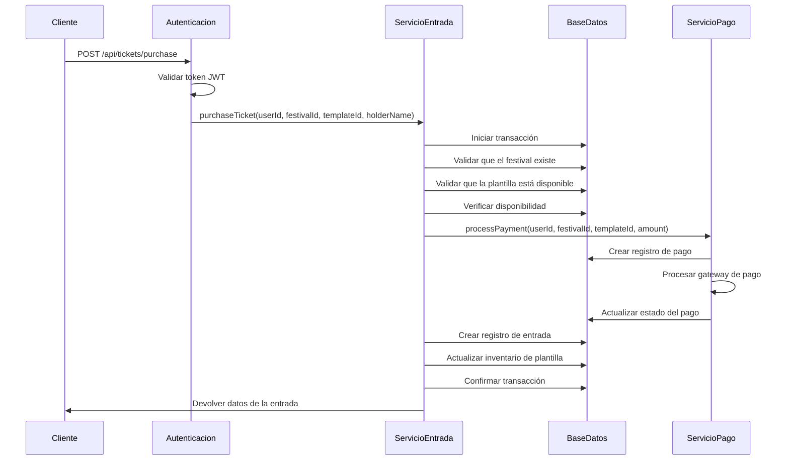

### Diagrama de Secuencia - Validación de Entrada

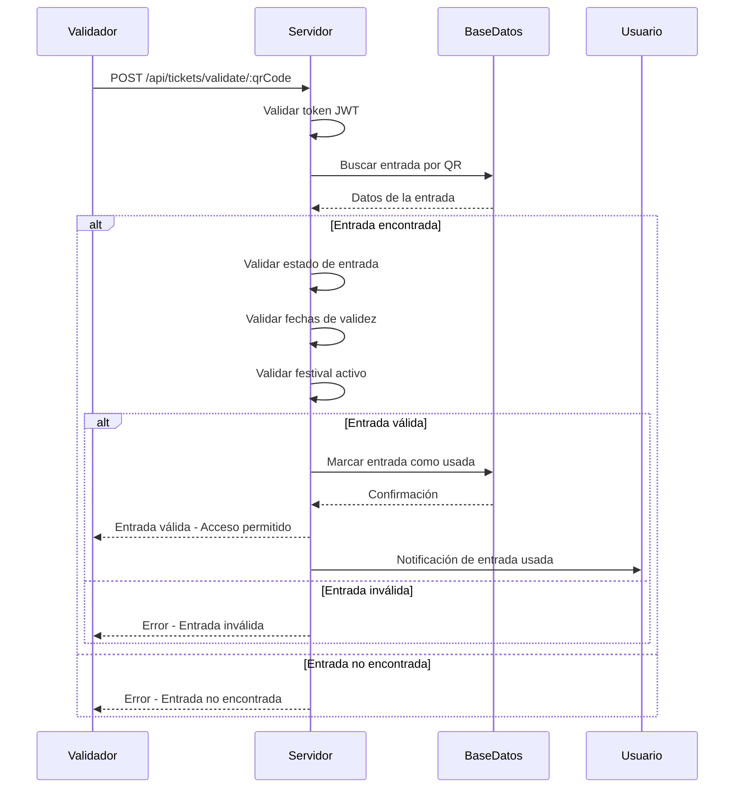

### Diagrama de Secuencia - Sistema de Chat

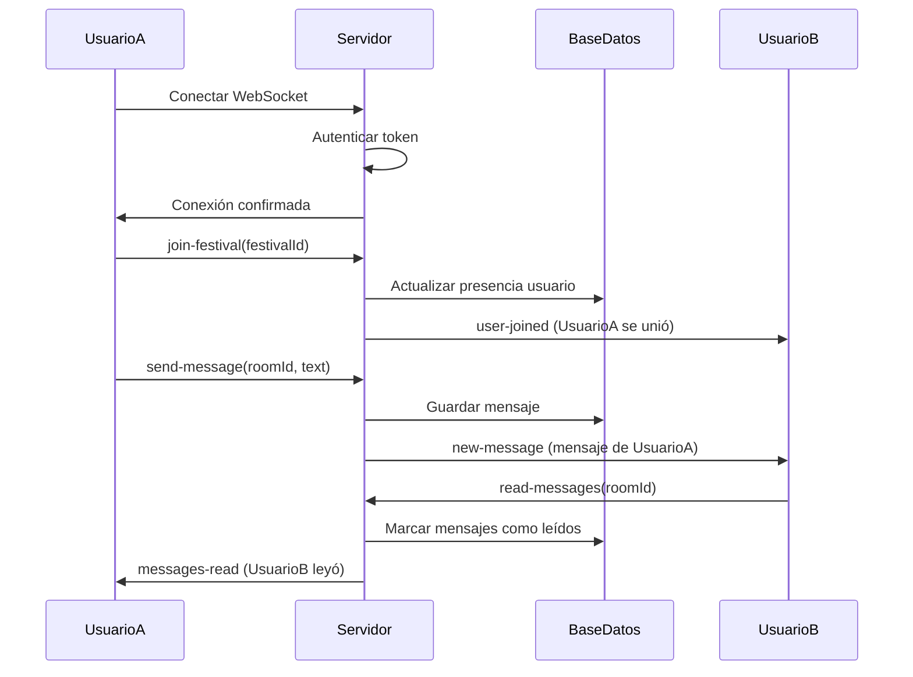

### Diagrama de Secuencia - Proceso de Pago

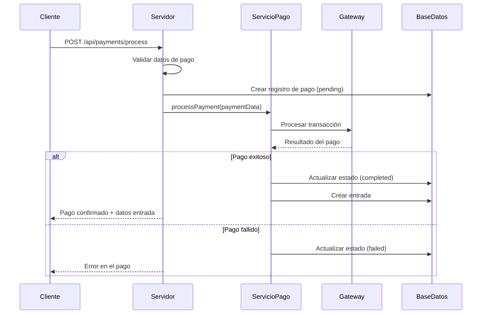

### Diagrama de Despliegue

```mermaid
deploymentDiagram
    deployment "Cliente Web" {
        node "Navegador" {
            artifact "React App"
        }
    }
    
    deployment "Cliente Móvil" {
        node "Dispositivo Móvil" {
            artifact "React Native App"
        }
    }
    
    deployment "Servidor de Aplicación" {
        node "Servidor Web" {
            artifact "Node.js + Express"
            artifact "Socket.IO"
        }
    }
    
    deployment "Base de Datos" {
        node "Servidor DB" {
            artifact "SQLite Database"
        }
    }
    
    deployment "Servicios Externos" {
        node "Gateway de Pagos" {
            artifact "Stripe/PayPal"
        }
        node "Servicio de Email" {
            artifact "SendGrid"
        }
    }
    
    "Navegador" --> "Servidor Web" : HTTP/HTTPS
    "Dispositivo Móvil" --> "Servidor Web" : HTTP/HTTPS
    "Dispositivo Móvil" --> "Servidor Web" : WebSocket
    "Servidor Web" --> "Servidor DB" : SQL
    "Servidor Web" --> "Gateway de Pagos" : API
    "Servidor Web" --> "Servicio de Email" : SMTP
```

### Diagrama de Actividades - Flujo de Compra de Entrada

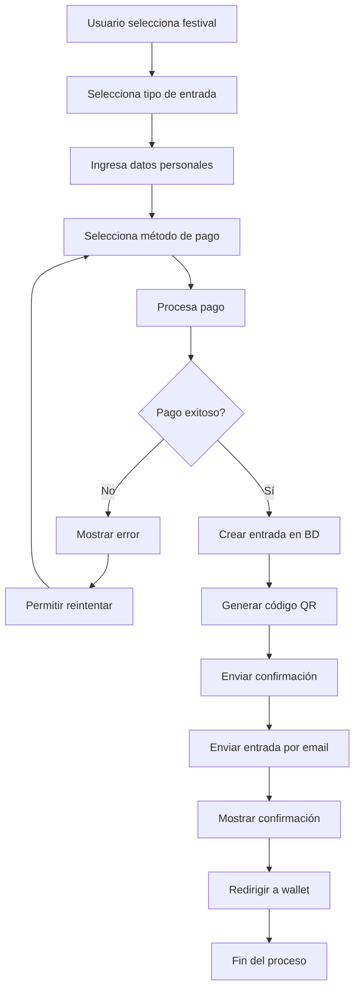

### Diagrama de Casos de Uso

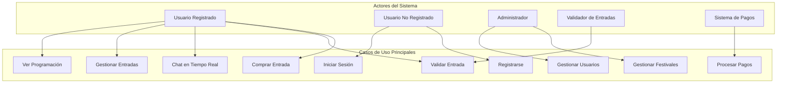

### Diagrama de Paquetes

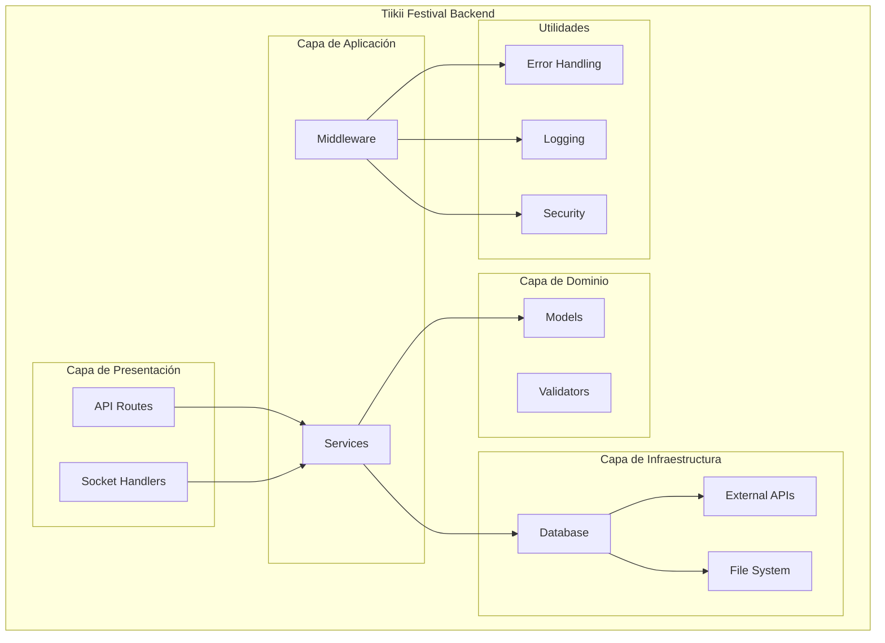

### Diagrama de Entidad-Relación (ERD)

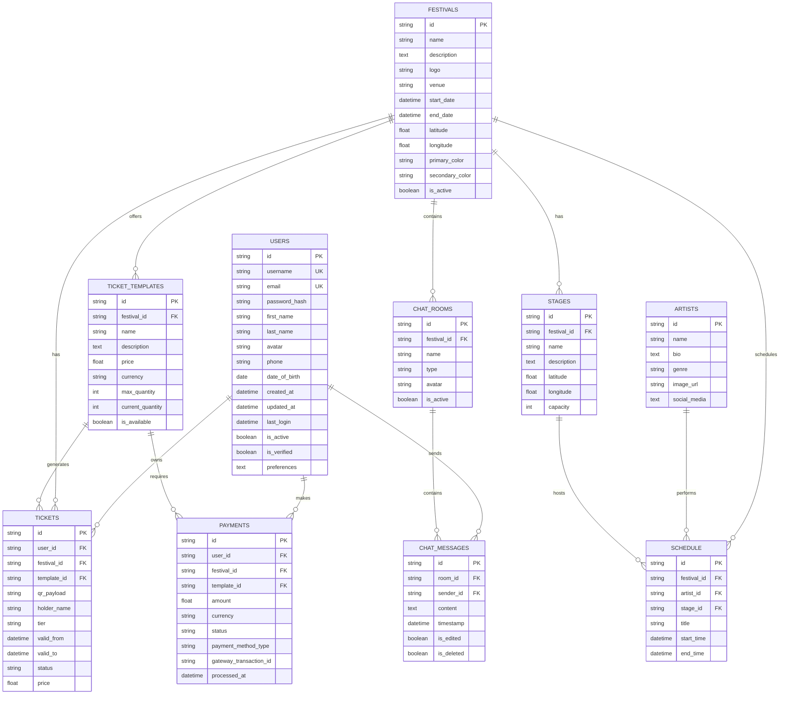

### Diagrama de Arquitectura de Red

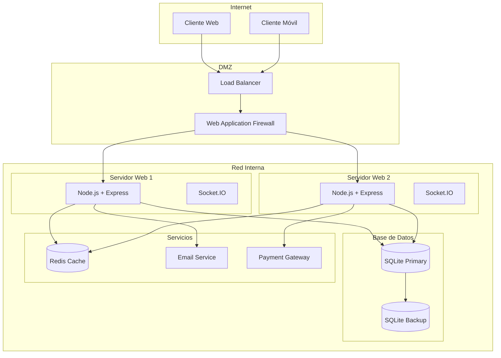

### Diagrama de Flujo de Datos

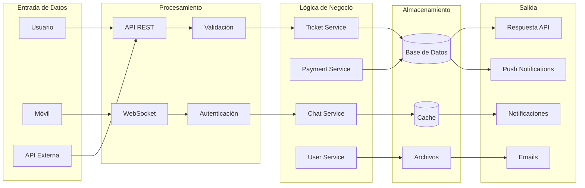

### Diagrama de Estrategia de Testing

```mermaid
graph TB
    subgraph "Estrategia de Testing"
        subgraph "Testing Unitario"
            TU1[Services Tests]
            TU2[Utils Tests]
            TU3[Models Tests]
        end
        
        subgraph "Testing de Integración"
            TI1[API Endpoints]
            TI2[Database Operations]
            TI3[External Services]
        end
        
        subgraph "Testing de Rendimiento"
            TP1[Load Testing]
            TP2[Stress Testing]
            TP3[Performance Testing]
        end
        
        subgraph "Testing de Seguridad"
            TS1[Authentication Tests]
            TS2[Authorization Tests]
            TS3[Vulnerability Tests]
        end
        
        subgraph "Testing de UI/UX"
            TUI1[Component Tests]
            TUI2[Integration Tests]
            TUI3[E2E Tests]
        end
    end
    
    subgraph "Herramientas"
        JEST[Jest Framework]
        SUPERTEST[Supertest]
        ARTILLERY[Artillery]
        OWASP[OWASP ZAP]
        CYPRESS[Cypress]
    end
    
    TU1 --> JEST
    TU2 --> JEST
    TU3 --> JEST
    TI1 --> SUPERTEST
    TI2 --> SUPERTEST
    TP1 --> ARTILLERY
    TS1 --> OWASP
    TUI1 --> CYPRESS
```

### Diagrama de Pipeline CI/CD

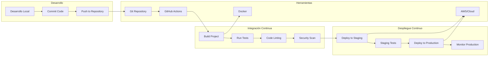

---

## Consideraciones de Seguridad

### Vulnerabilidades Identificadas y Mitigadas

#### 1. Inyección SQL
- **Mitigación**: Uso de consultas parametrizadas
- **Implementación**: Todas las consultas usan `?` placeholders

#### 2. Autenticación JWT
- **Mitigación**: Verificación de tokens en cada solicitud
- **Implementación**: Middleware `authenticateToken`

#### 3. Rate Limiting
- **Mitigación**: Limitación de solicitudes por IP
- **Implementación**: `express-rate-limit` middleware

#### 4. Validación de Entrada
- **Mitigación**: Validación estricta de datos de entrada
- **Implementación**: `express-validator` con reglas personalizadas

#### 5. Headers de Seguridad
- **Mitigación**: Configuración de Helmet.js
- **Implementación**: CSP, XSS protection, HSTS

### Auditoría de Seguridad

```bash
# Ejecutar auditoría de seguridad
npm run security:audit

# Corregir vulnerabilidades automáticamente
npm run security:fix
```

---

## Mantenimiento y Escalabilidad

### Monitoreo y Logging

#### Logging Estructurado
```javascript
// Configuración de logging
const logger = {
    info: (message, meta = {}) => {
        console.log(JSON.stringify({
            level: 'info',
            message,
            timestamp: new Date().toISOString(),
            ...meta
        }));
    },
    error: (message, error = {}, meta = {}) => {
        console.error(JSON.stringify({
            level: 'error',
            message,
            error: error.message,
            stack: error.stack,
            timestamp: new Date().toISOString(),
            ...meta
        }));
    }
};
```

#### Métricas de Rendimiento
```javascript
// Middleware de métricas
app.use((req, res, next) => {
    const start = Date.now();
    
    res.on('finish', () => {
        const duration = Date.now() - start;
        logger.info('Request completed', {
            method: req.method,
            url: req.url,
            status: res.statusCode,
            duration: `${duration}ms`
        });
    });
    
    next();
});
```

### Estrategias de Escalabilidad

#### 1. Escalabilidad Horizontal
- **Load Balancing**: Múltiples instancias del servidor
- **Database Sharding**: Particionamiento de base de datos por festival
- **Microservicios**: Separación de funcionalidades en servicios independientes

#### 2. Escalabilidad Vertical
- **Connection Pooling**: Pool de conexiones de base de datos
- **Caching**: Redis para datos frecuentemente accedidos
- **CDN**: Distribución de contenido estático

#### 3. Optimización de Base de Datos
```sql
-- Índices compuestos para consultas complejas
CREATE INDEX idx_tickets_user_festival_status ON tickets(user_id, festival_id, status);

-- Particionamiento por fecha
CREATE TABLE tickets_2024 PARTITION OF tickets
FOR VALUES FROM ('2024-01-01') TO ('2025-01-01');
```

### Backup y Recuperación

#### Estrategia de Backup
```javascript
// Script de backup automático
const backupDatabase = async () => {
    const backupPath = `./backups/tiikii_festival_${Date.now()}.db`;
    
    try {
        await database.backup(backupPath);
        logger.info('Database backup completed', { path: backupPath });
        
        // Limpiar backups antiguos (mantener solo los últimos 7 días)
        await cleanupOldBackups();
    } catch (error) {
        logger.error('Database backup failed', error);
    }
};

// Programar backup diario
setInterval(backupDatabase, 24 * 60 * 60 * 1000);
```

---

## Conclusión

El backend de Tiikii Festival implementa una arquitectura de capas con patrones de diseño establecidos que proporcionan una base sólida para el crecimiento del sistema. Con la integración de BitChat, el sistema ahora ofrece capacidades avanzadas de comunicación offline y gestión de estadías.

### Puntos Clave de la Implementación

1. **Arquitectura Modular**: Separación de responsabilidades entre capas
2. **Comunicación Mesh**: Integración de BitChat para funcionamiento offline
3. **Gestión de Estadías**: Sistema completo de control de acceso a espacios
4. **Sincronización Offline**: Cola automática de sincronización de datos
5. **Seguridad Avanzada**: Cifrado end-to-end y protección multicapa
6. **Escalabilidad**: Diseño que permite crecimiento horizontal y vertical
7. **Testing Integral**: Cobertura de pruebas para validar toda la funcionalidad
8. **Documentación Completa**: Código y arquitectura completamente documentados

### Recomendaciones para el Futuro

1. **Migración a PostgreSQL**: Para mejor rendimiento en producción
2. **Implementación de Redis**: Para caching y sesiones
3. **Optimización de Red Mesh**: Implementación completa del protocolo BitChat
4. **Geolocalización Avanzada**: Integración con mapas y navegación indoor
5. **Análisis de Datos**: Dashboard de métricas de uso y comportamiento
6. **Monitoreo APM**: Integración con herramientas como New Relic o DataDog
7. **CI/CD Pipeline**: Automatización de despliegue y testing
8. **API Versioning**: Soporte para múltiples versiones de API
9. **Machine Learning**: Recomendaciones personalizadas y detección de fraude
10. **Realidad Aumentada**: Integración con experiencias AR para el festival

### Funcionalidades Avanzadas Implementadas

Con la integración de BitChat, el sistema ahora incluye:

- **Comunicación P2P**: Red mesh descentralizada para funcionamiento offline
- **Gestión de Estadías**: Control completo de acceso a espacios y habitaciones  
- **Sincronización Automática**: Cola inteligente de sincronización de datos
- **Criptografía Avanzada**: Protocolo Noise para cifrado end-to-end
- **Identidades Verificables**: Sistema de confianza distribuido

Este sistema proporciona una base sólida y moderna para la gestión de festivales, con capacidades avanzadas de funcionamiento offline y comunicación descentralizada, ideal para eventos en ubicaciones remotas o con conectividad limitada.
